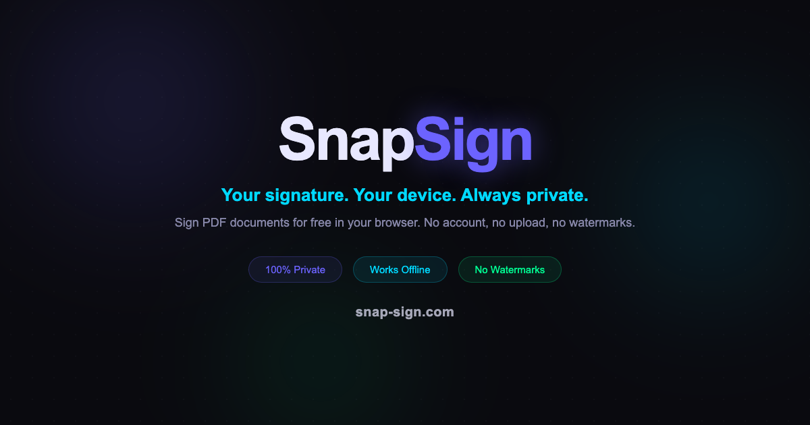

# SnapSign

**Sign PDFs for free. 100% in your browser. No uploads. No accounts. No watermarks.**



## Live Demo

[snap-sign.com](https://snap-sign.com)

## Features

- **Draw, type, or upload** your signature
- **Place multiple signatures** anywhere across a multi-page PDF
- **Adjust** opacity, rotation, and scale per signature
- **Download** the signed PDF instantly
- **Zero server** — all processing happens in your browser using [pdf-lib](https://github.com/Hopding/pdf-lib)
- **No account required** — just open and use
- **No watermarks** on the output
- Works on desktop and mobile

## Self-Hosting

SnapSign is a static site — just HTML, CSS, and JS. Host it anywhere.

### Option 1: Docker

```bash
docker build -t snapsign .
docker run -d -p 8080:80 snapsign
```

Open [http://localhost:8080](http://localhost:8080)

### Option 2: npm

```bash
cd frontend
npm install
npm run build
```

Serve the `frontend/dist` folder with any static file server:

```bash
npx serve frontend/dist
```

### Option 3: Docker Compose

```yaml
services:
  snapsign:
    build: .
    ports:
      - "8080:80"
    restart: unless-stopped
```

```bash
docker compose up -d
```

## Tech Stack

- React 19 + Vite
- pdf-lib (PDF manipulation)
- react-pdf (PDF rendering)
- Tailwind CSS
- Framer Motion

## Privacy

Your files never leave your device. There is no backend. No analytics on your documents. Everything runs client-side in your browser.

## License

MIT
